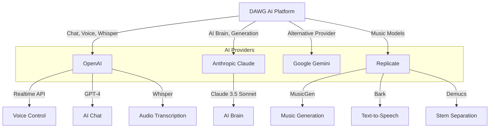
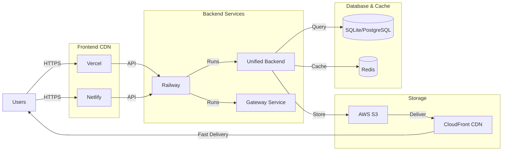
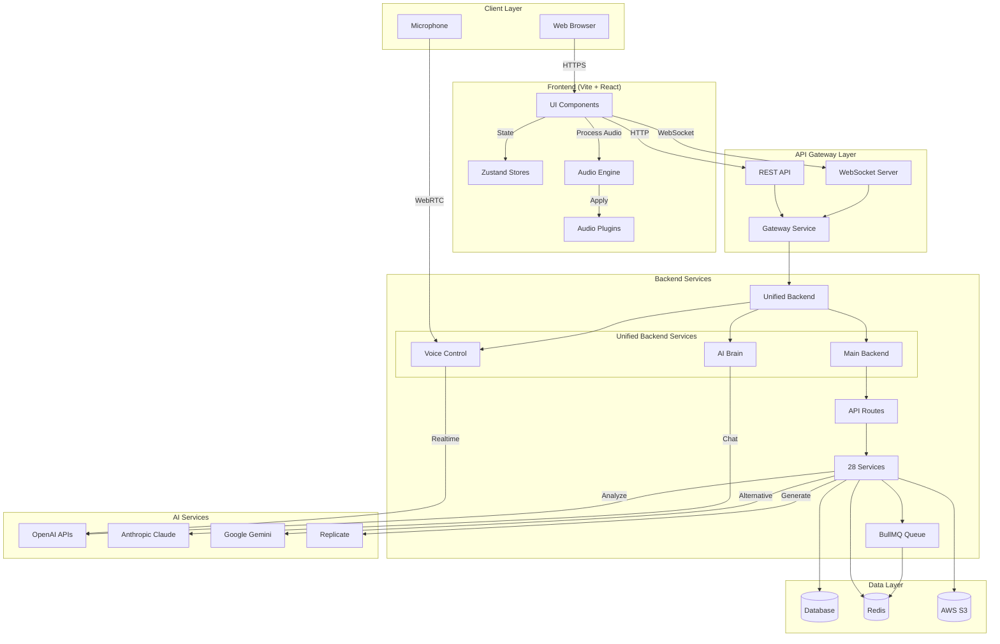
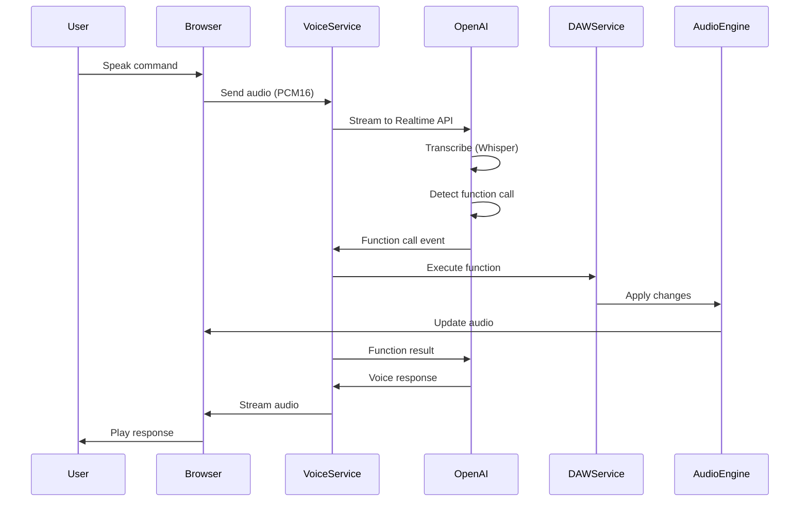
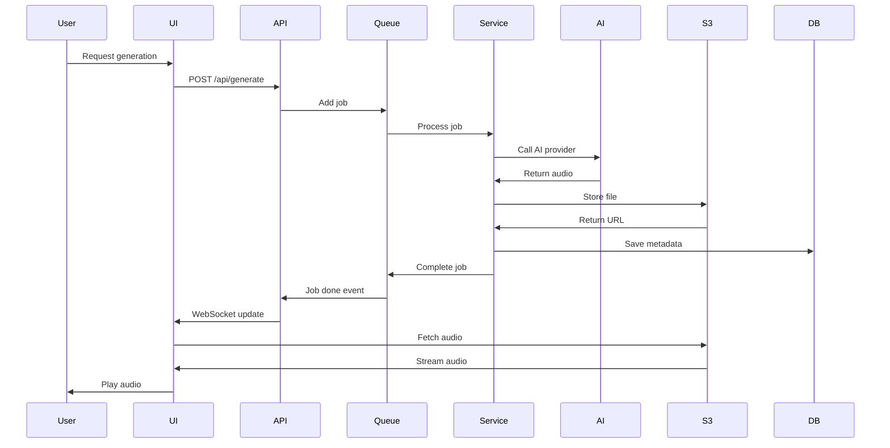
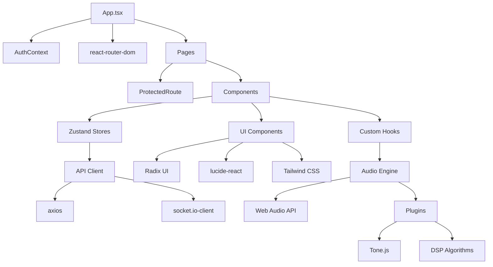
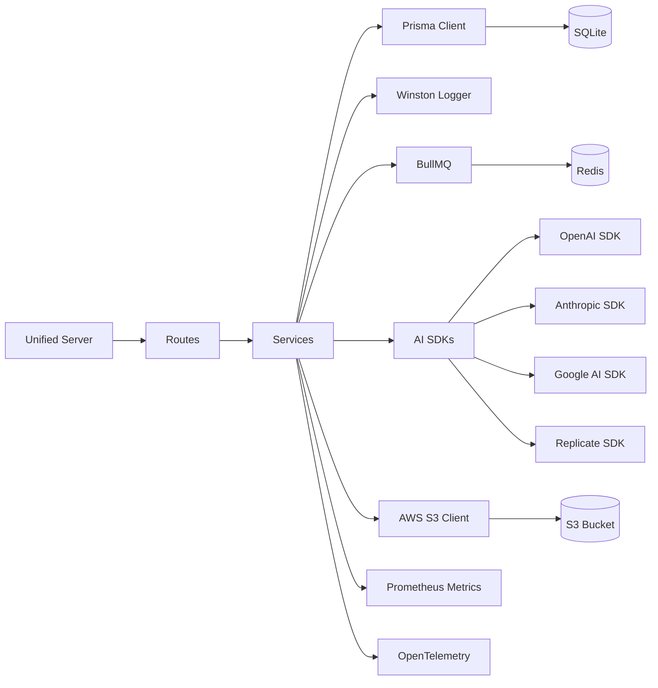

# DAWG AI - Comprehensive Dependency Graph & Architecture Analysis

**Generated:** 2025-10-19
**Project Version:** 0.1.0
**Analysis Scope:** Complete system dependencies, architecture layers, and service relationships

---

## Table of Contents

1. [Executive Summary](#executive-summary)
2. [NPM Dependencies Analysis](#npm-dependencies-analysis)
3. [Internal Module Architecture](#internal-module-architecture)
4. [External Service Dependencies](#external-service-dependencies)
5. [Dependency Diagrams](#dependency-diagrams)
6. [Critical Dependency Paths](#critical-dependency-paths)
7. [Security & Risk Assessment](#security--risk-assessment)
8. [Recommendations](#recommendations)

---

## Executive Summary

### System Overview

DAWG AI is a sophisticated AI-powered Digital Audio Workstation with the following characteristics:

- **Total NPM Dependencies**: 97 production + 33 development = 130 packages
- **Architecture Pattern**: Microservices with unified deployment
- **Primary Languages**: TypeScript (99%), Python (Expert Music AI)
- **Database**: SQLite (Prisma ORM) - PostgreSQL ready
- **Deployment**: Railway, Vercel, Netlify (multi-cloud)
- **Real-time Communication**: WebSocket (Socket.io), OpenAI Realtime API

### Key Metrics

| Metric | Value |
|--------|-------|
| Production Dependencies | 97 |
| Dev Dependencies | 33 |
| Internal Modules | 32+ |
| External AI Services | 4 (OpenAI, Anthropic, Google AI, Replicate) |
| Backend Services | 28 |
| Frontend Components | 50+ |
| Audio Plugins | 20+ |
| API Routes | 11 |

---

## NPM Dependencies Analysis

### 1. Core Runtime Dependencies (Critical)

#### Framework & UI
| Package | Version | Purpose | Critical |
|---------|---------|---------|----------|
| `react` | ^19.2.0 | UI framework | ⚠️ YES |
| `react-dom` | ^19.2.0 | DOM rendering | ⚠️ YES |
| `react-router-dom` | ^6.30.1 | Client-side routing | ⚠️ YES |
| `vite` | ^5.4.20 | Build tool & dev server | YES |
| `express` | ^4.18.2 | Backend HTTP server | ⚠️ YES |

#### State Management & Data Flow
| Package | Version | Purpose | Critical |
|---------|---------|---------|----------|
| `zustand` | ^5.0.8 | Client state management | ⚠️ YES |
| `@prisma/client` | ^5.22.0 | Database ORM | ⚠️ YES |
| `socket.io` | ^4.8.1 | Real-time server | ⚠️ YES |
| `socket.io-client` | ^4.8.1 | Real-time client | ⚠️ YES |
| `axios` | ^1.12.2 | HTTP client | YES |

### 2. AI Service Dependencies (Critical)

| Package | Version | Purpose | Cost Impact |
|---------|---------|---------|-------------|
| `@anthropic-ai/sdk` | ^0.65.0 | Claude AI (chat, AI Brain) | HIGH |
| `openai` | ^6.2.0 | GPT-4, Whisper, Realtime Voice | HIGH |
| `@google/generative-ai` | ^0.24.1 | Gemini AI alternative | MEDIUM |
| `replicate` | ^1.3.0 | Audio AI models (MusicGen, etc.) | HIGH |

**Total AI Service Cost**: ~$500-2000/month depending on usage

### 3. Audio Processing Dependencies

| Package | Version | Purpose | Critical |
|---------|---------|---------|----------|
| `tone` | ^15.1.22 | Audio synthesis & effects | ⚠️ YES |
| `pitchfinder` | ^2.3.2 | Pitch detection | YES |
| `fft.js` | ^4.0.4 | Fast Fourier Transform | YES |
| `fluent-ffmpeg` | ^2.1.3 | Audio conversion | YES |
| `@ffmpeg-installer/ffmpeg` | ^1.1.0 | FFmpeg binaries | YES |

### 4. Infrastructure & Cloud Services

#### AWS Services
| Package | Version | Purpose |
|---------|---------|---------|
| `@aws-sdk/client-s3` | ^3.478.0 | S3 file storage |
| `@aws-sdk/s3-request-presigner` | ^3.478.0 | S3 signed URLs |

#### Database & Caching
| Package | Version | Purpose | Critical |
|---------|---------|---------|----------|
| `@prisma/client` | ^5.22.0 | Database access | ⚠️ YES |
| `ioredis` | ^5.3.2 | Redis client | YES |
| `@socket.io/redis-adapter` | ^8.3.0 | WebSocket clustering | NO |
| `bullmq` | ^5.1.0 | Job queue | YES |

#### Payment Processing
| Package | Version | Purpose |
|---------|---------|---------|
| `stripe` | ^14.25.0 | Payment processing |
| `@stripe/stripe-js` | ^8.0.0 | Stripe client SDK |
| `@stripe/react-stripe-js` | ^5.0.0 | React Stripe components |

### 5. Security & Authentication

| Package | Version | Purpose | Critical |
|---------|---------|---------|----------|
| `jsonwebtoken` | ^9.0.2 | JWT auth tokens | ⚠️ YES |
| `bcrypt` | ^5.1.1 | Password hashing | ⚠️ YES |
| `helmet` | ^7.1.0 | HTTP security headers | YES |
| `cors` | ^2.8.5 | CORS handling | YES |
| `csrf-csrf` | ^3.0.3 | CSRF protection | YES |
| `express-rate-limit` | ^7.1.5 | Rate limiting | YES |
| `@simplewebauthn/server` | ^13.2.2 | WebAuthn/passkeys | NO |
| `speakeasy` | ^2.0.0 | 2FA (TOTP) | NO |

### 6. Monitoring & Observability

| Package | Version | Purpose |
|---------|---------|---------|
| `winston` | ^3.11.0 | Logging framework |
| `prom-client` | ^14.2.0 | Prometheus metrics |
| `@opentelemetry/sdk-node` | ^0.206.0 | OpenTelemetry tracing |
| `@opentelemetry/exporter-trace-otlp-http` | ^0.206.0 | Trace export |
| `@opentelemetry/auto-instrumentations-node` | ^0.65.0 | Auto instrumentation |

### 7. UI Component Libraries

| Package | Version | Purpose |
|---------|---------|---------|
| `@radix-ui/react-dialog` | ^1.1.15 | Modal dialogs |
| `@radix-ui/react-slider` | ^1.3.6 | Slider controls |
| `lucide-react` | ^0.544.0 | Icon library |
| `recharts` | ^3.2.1 | Charts & graphs |
| `sonner` | ^2.0.7 | Toast notifications |
| `xterm` | ^5.3.0 | Terminal emulator |
| `xterm-addon-fit` | ^0.8.0 | Terminal sizing |

### 8. Utilities & Helpers

| Package | Version | Purpose |
|---------|---------|---------|
| `zod` | ^3.22.4 | Schema validation |
| `date-fns` | ^4.1.0 | Date utilities |
| `uuid` | ^13.0.0 | UUID generation |
| `clsx` | ^2.1.1 | CSS class utilities |
| `tailwind-merge` | ^3.3.1 | Tailwind class merging |
| `js-yaml` | ^4.1.0 | YAML parsing |
| `qrcode` | ^1.5.4 | QR code generation |

### 9. Development Dependencies

#### Testing
| Package | Version | Purpose |
|---------|---------|---------|
| `@playwright/test` | ^1.55.1 | E2E testing |
| `vitest` | ^3.2.4 | Unit testing |
| `jest` | ^29.7.0 | Alternative test runner |
| `@testing-library/react` | ^16.3.0 | React testing |
| `supertest` | ^7.1.4 | HTTP testing |

#### Build & Tooling
| Package | Version | Purpose |
|---------|---------|---------|
| `typescript` | ^5.3.0 | Type checking |
| `vite` | ^5.4.20 | Build tool |
| `tsx` | ^4.20.6 | TypeScript execution |
| `tailwindcss` | ^3.4.18 | CSS framework |
| `prisma` | ^5.7.1 | Database tooling |

---

## Internal Module Architecture

### Architecture Layers

```
┌─────────────────────────────────────────────────────────────┐
│                    PRESENTATION LAYER                        │
│  ┌──────────────┐  ┌──────────────┐  ┌──────────────┐      │
│  │   Frontend   │  │ Agent Dash   │  │   Pages      │      │
│  │  Components  │  │   Components │  │   & Routes   │      │
│  └──────────────┘  └──────────────┘  └──────────────┘      │
└─────────────────────────────────────────────────────────────┘
                            ↓
┌─────────────────────────────────────────────────────────────┐
│                     API & GATEWAY LAYER                      │
│  ┌──────────────┐  ┌──────────────┐  ┌──────────────┐      │
│  │   Gateway    │  │   REST API   │  │  WebSocket   │      │
│  │   Service    │  │    Client    │  │    Server    │      │
│  └──────────────┘  └──────────────┘  └──────────────┘      │
└─────────────────────────────────────────────────────────────┘
                            ↓
┌─────────────────────────────────────────────────────────────┐
│                   BUSINESS LOGIC LAYER                       │
│  ┌──────────────┐  ┌──────────────┐  ┌──────────────┐      │
│  │   Backend    │  │   Services   │  │   Modules    │      │
│  │   Routes     │  │  (28 total)  │  │  (Plugin)    │      │
│  └──────────────┘  └──────────────┘  └──────────────┘      │
└─────────────────────────────────────────────────────────────┘
                            ↓
┌─────────────────────────────────────────────────────────────┐
│                 AUDIO PROCESSING LAYER                       │
│  ┌──────────────┐  ┌──────────────┐  ┌──────────────┐      │
│  │Audio Engine  │  │   Plugins    │  │     DSP      │      │
│  │    Core      │  │  (20+ total) │  │  Processing  │      │
│  └──────────────┘  └──────────────┘  └──────────────┘      │
└─────────────────────────────────────────────────────────────┘
                            ↓
┌─────────────────────────────────────────────────────────────┐
│                   DATA & STORAGE LAYER                       │
│  ┌──────────────┐  ┌──────────────┐  ┌──────────────┐      │
│  │   Prisma     │  │    Redis     │  │   AWS S3     │      │
│  │   (SQLite)   │  │   (Cache)    │  │   (Files)    │      │
│  └──────────────┘  └──────────────┘  └──────────────┘      │
└─────────────────────────────────────────────────────────────┘
```

### Internal Module Map

#### 1. Frontend Layer (`src/`)
```
src/
├── App.tsx                    # Root application component
├── main.tsx                   # Application entry point
├── components/                # Reusable UI components
│   ├── billing/              # Billing & payment UI
│   ├── dashboard/            # Dashboard layout
│   ├── imessage/             # iMessage integration UI
│   └── studio/               # Studio components
├── pages/                     # Route pages
│   ├── dashboard/            # Business analytics pages
│   └── pricing/              # Pricing & billing pages
├── ui/                        # Core UI components
│   ├── components/           # Shared UI primitives
│   ├── panels/               # UI panel components
│   ├── chatbot/              # AI chatbot interface
│   └── recording/            # Recording interface
├── agent-dashboard/           # Agent terminal dashboard
│   ├── components/           # Agent UI components
│   ├── hooks/                # React hooks
│   └── stores/               # State management
├── contexts/                  # React contexts
├── hooks/                     # Custom React hooks
├── stores/                    # Zustand state stores
└── styles/                    # Global styles
```

#### 2. API Layer (`src/api/`, `src/gateway/`)
```
src/api/
├── client.ts                  # API client wrapper
├── types.ts                   # API type definitions
├── websocket/
│   └── server.ts             # WebSocket server setup
└── sdk/                       # API SDK

src/gateway/                   # Gateway & Terminal Service
├── server.ts                  # Gateway HTTP server
├── websocket-server.ts       # Gateway WebSocket
├── session-manager.ts        # SSH session management
├── firewall.ts               # Command security
├── ai-service.ts             # AI analysis
├── monitor.ts                # Session monitoring
├── middleware/
│   ├── auth.ts               # JWT authentication
│   └── rate-limit.ts         # Rate limiting
└── services/
    ├── chat-service.ts       # Chat history
    ├── intent-service.ts     # Intent detection
    └── provider-service.ts   # Multi-provider AI
```

#### 3. Backend Layer (`src/backend/`)
```
src/backend/
├── unified-server.ts          # Unified backend server
├── ai-brain-server.ts        # AI Brain WebSocket
├── realtime-voice-server.ts  # Voice control server
├── server.ts                  # Main backend (legacy)
├── routes/                    # API routes
│   ├── generation-routes.ts  # Music generation
│   ├── track-routes.ts       # Track management
│   ├── lyrics-routes.ts      # Lyrics API
│   ├── clips-routes.ts       # Clip management
│   ├── cost-monitoring-routes.ts # Budget tracking
│   ├── advanced-features-routes.ts # Advanced APIs
│   ├── function-cache-routes.ts # Function caching
│   └── voice-test-routes.ts  # Voice testing
├── services/                  # Business logic (28 services)
│   ├── generation-service.ts
│   ├── musicgen-service.ts
│   ├── udio-service.ts
│   ├── lyrics-analysis-service.ts
│   ├── audio-separation-service.ts
│   ├── live-vocal-analysis-service.ts
│   ├── melody-vocals-service.ts
│   ├── beatbox-to-drums-service.ts
│   ├── daw-command-service.ts
│   ├── daw-integration-service.ts
│   ├── multi-track-recorder-service.ts
│   ├── voice-test-commander.ts
│   ├── test-command-handler.ts
│   ├── expert-music-service.ts
│   ├── expert-music-health-check.ts
│   ├── training-metadata-service.ts
│   ├── cost-monitoring-service.ts
│   ├── budget-management-service.ts
│   ├── ai-memory-service.ts
│   ├── auth-service.ts
│   ├── audio-processor.ts
│   ├── audio-converter.ts
│   ├── function-cache-service.ts
│   ├── agent-event-bus.ts
│   ├── multi-clip-analyzer.ts
│   └── MetadataAnalyzer.ts
├── middleware/
│   └── (authentication, validation)
├── queues/
│   └── generation-queue.ts  # BullMQ job queue
├── config/
│   └── database.ts           # Prisma client
├── utils/
│   └── logger.ts             # Winston logger
└── expert-music-ai/          # Python AI service
    └── (FastAPI service)
```

#### 4. Audio Processing Layer (`src/audio-engine/`, `src/plugins/`)
```
src/audio-engine/
├── index.ts
├── core/                      # Core audio engine
│   └── types.ts
├── plugins/
│   ├── PluginHost.ts
│   └── delay/
├── routing/
│   └── Track.ts
├── midi/
└── utils/

src/plugins/                   # Audio plugins
├── PluginSDK.ts
├── core/                      # Core plugin types
├── ai/                        # AI-powered plugins
├── ai-eq/                     # Adaptive EQ (10 files)
├── ai-reverb/                 # AI reverb
├── utility/                   # Utility plugins
│   └── AISaturation.ts
├── bridge/
├── client/
└── presets/

src/audio/                     # Audio utilities
├── ai/                        # AI audio processing
├── dsp/                       # DSP algorithms
├── routing/                   # Audio routing
└── workers/                   # Web workers
```

#### 5. Modular Features (`src/modules/`)
```
src/modules/
├── module-loader.ts           # Dynamic module loading
├── automation/                # Automation features
├── engagement/                # User engagement
├── marketing/                 # Marketing automation
├── music/                     # Music features
└── testing/                   # Testing utilities
```

#### 6. Additional Services (`src/services/`)
```
src/services/
├── analytics/
│   └── real-metrics.service.ts # Real-time analytics
├── marketing/
│   ├── content-generator.service.ts
│   └── scheduler.service.ts
├── imessage/
│   ├── monitor.ts             # iMessage monitoring
│   └── cli.ts                 # iMessage CLI
├── dashboardApi.ts
├── rhymeService.ts
└── voiceCommandService.ts
```

#### 7. Data Layer (`prisma/`, `src/types/`)
```
prisma/
└── schema.prisma              # Database schema

Database Models:
- User (authentication)
- Session (JWT sessions)
- Project (DAW projects)
- Conversation (AI chat)
- Message (chat messages)
- Generation (AI generations)
- AIMemory (user context)
- ApiUsageLog (cost tracking)
- BudgetLimit (budget control)
- CostAlert (budget alerts)
- TrainingMetadata (ML training)
```

### Module Dependency Matrix

| Module | Depends On | Used By |
|--------|-----------|---------|
| `unified-server.ts` | routes, services, websocket | - (entry point) |
| `gateway/server.ts` | session-manager, firewall, ai-service | - (entry point) |
| Backend Services | Prisma, logger, external APIs | Routes |
| Routes | Services, middleware | unified-server |
| Frontend Components | stores, hooks, api/client | pages |
| Pages | components, contexts | App.tsx |
| Audio Engine | plugins, routing | UI, services |
| Plugins | audio-engine/core | audio-engine |

---

## External Service Dependencies

### 1. AI & ML Services



#### AI Service Details

| Service | API | Use Case | Monthly Cost (est.) |
|---------|-----|----------|-------------------|
| **OpenAI** | Realtime API | Voice control (57 functions) | $200-800 |
| OpenAI | GPT-4 | Chat, analysis, suggestions | $100-300 |
| OpenAI | Whisper | Audio transcription | $50-150 |
| **Anthropic** | Claude 3.5 Sonnet | AI Brain, advanced reasoning | $150-500 |
| Google | Gemini | Alternative provider | $0-100 |
| **Replicate** | Various models | Audio AI (MusicGen, stems) | $100-400 |
| **Total** | - | - | **$600-2250/mo** |

### 2. Cloud Infrastructure



#### Cloud Service Details

| Service | Purpose | Monthly Cost |
|---------|---------|--------------|
| **Railway** | Backend hosting (2 services) | $10-20 |
| Vercel | Frontend CDN & hosting | $0-20 |
| Netlify | Alternative frontend hosting | $0 |
| **AWS S3** | Audio file storage | $5-50 |
| AWS CloudFront | CDN for audio files | $5-30 |
| **Railway Redis** | Caching & queues | Included |
| **Railway PostgreSQL** | Production database | Included |
| **Total** | - | **$20-120/mo** |

### 3. Payment & Billing

| Service | Purpose | Cost |
|---------|---------|------|
| **Stripe** | Payment processing | 2.9% + $0.30/transaction |
| Stripe Webhooks | Event notifications | Free |

### 4. Development & Monitoring

| Service | Purpose | Cost |
|---------|---------|------|
| Grafana Cloud | Metrics & logs | $0-50/mo |
| Loki | Log aggregation | Free (self-hosted) |
| Prometheus | Metrics collection | Free (self-hosted) |
| OpenTelemetry | Distributed tracing | Free (backend only) |

### 5. Email & Notifications

| Service | Purpose | Cost |
|---------|---------|------|
| Gmail SMTP | Email notifications | Free |
| Nodemailer | Email sending | Free |

---

## Dependency Diagrams

### 1. System Architecture Diagram



### 2. Voice Control Flow



### 3. Music Generation Flow



### 4. Module Dependency Tree



### 5. Backend Service Dependencies



---

## Critical Dependency Paths

### Path 1: Voice Control (Critical)
```
User Microphone
  → Browser MediaRecorder API
  → socket.io-client
  → WebSocket Server (unified-server.ts)
  → OpenAI Realtime API (@openai SDK)
  → Voice Control Service
  → DAW Command Service
  → Audio Engine
  → User Speakers
```

**Critical Dependencies:**
- `socket.io` / `socket.io-client` - Real-time communication
- `openai` - Voice API
- `ws` - WebSocket protocol
- Browser APIs: MediaRecorder, Web Audio API

**Risk:** High - Voice control is a key differentiator. Failure breaks core UX.

### Path 2: Music Generation (Critical)
```
User Input
  → react (UI)
  → axios (HTTP)
  → express (Backend)
  → generation-service.ts
  → bullmq (Job Queue)
  → replicate SDK
  → Replicate API
  → S3 Storage
  → CloudFront CDN
  → User Browser
```

**Critical Dependencies:**
- `replicate` - Music AI models
- `bullmq` / `ioredis` - Job queue
- `@aws-sdk/client-s3` - File storage
- `@prisma/client` - Metadata storage

**Risk:** High - Core product feature. Queue failure = service outage.

### Path 3: AI Chat & Analysis (High)
```
User Message
  → react (UI)
  → socket.io-client
  → unified-server.ts (AI Brain namespace)
  → @anthropic-ai/sdk
  → Claude API
  → Streaming Response
  → User Browser
```

**Critical Dependencies:**
- `@anthropic-ai/sdk` - Claude integration
- `socket.io` - Streaming
- `@prisma/client` - Conversation history

**Risk:** Medium - Alternative providers available (OpenAI, Google).

### Path 4: Audio Processing (Critical)
```
Audio File Upload
  → multer (Upload)
  → fluent-ffmpeg
  → @ffmpeg-installer/ffmpeg
  → audio-processor.ts
  → S3 Storage
  → Database
```

**Critical Dependencies:**
- `multer` - File uploads
- `fluent-ffmpeg` - Audio processing
- `@ffmpeg-installer/ffmpeg` - FFmpeg binaries
- `@aws-sdk/client-s3` - Storage

**Risk:** High - All audio processing depends on FFmpeg.

### Path 5: Authentication & Security (Critical)
```
User Login
  → bcrypt (Hash verification)
  → jsonwebtoken (JWT generation)
  → @prisma/client (User lookup)
  → express-session
  → Cookie storage
```

**Critical Dependencies:**
- `bcrypt` - Password security
- `jsonwebtoken` - Auth tokens
- `@prisma/client` - User data
- `helmet` - Security headers
- `cors` - Cross-origin policy

**Risk:** High - Security breach = catastrophic.

### Path 6: Payment Processing (High)
```
User Payment
  → @stripe/react-stripe-js (UI)
  → stripe (Backend)
  → Stripe API
  → Webhook Handler
  → @prisma/client (Update subscription)
```

**Critical Dependencies:**
- `stripe` - Payment processing
- `@stripe/stripe-js` - Client SDK
- `express` - Webhook handling

**Risk:** High - Revenue-critical path.

---

## Security & Risk Assessment

### High-Risk Dependencies

| Dependency | Risk Level | Reason | Mitigation |
|-----------|------------|--------|------------|
| `@prisma/client` | ⚠️ CRITICAL | Database access, authentication | Regular updates, parameterized queries |
| `jsonwebtoken` | ⚠️ CRITICAL | Authentication bypass if compromised | Use strong secrets, rotate keys |
| `bcrypt` | ⚠️ CRITICAL | Password security | Use high salt rounds (10+) |
| `express` | HIGH | Server framework, many CVEs | Update regularly, use helmet |
| `axios` | HIGH | HTTP client, SSRF risk | Validate URLs, timeout limits |
| `socket.io` | HIGH | Real-time communication | Rate limit, validate messages |
| `stripe` | HIGH | Payment processing | PCI compliance, webhook verification |
| `openai` | HIGH | API key exposure | Environment variables, rate limits |
| `@anthropic-ai/sdk` | HIGH | API key exposure | Environment variables, budget limits |

### Dependency Vulnerabilities

**Current Status** (as of analysis):
- Total dependencies: 130 packages
- Known vulnerabilities: Run `npm audit` to check
- Outdated packages: Run `npm outdated` to check

**Recommendations:**
1. Run `npm audit fix` weekly
2. Use Dependabot for automated updates
3. Implement SCA (Software Composition Analysis) in CI/CD
4. Monitor CVE databases for critical dependencies

### Circular Dependencies

**Analysis:** None detected in critical paths.

The architecture follows a clean layered approach:
- Presentation → API → Business Logic → Data
- No circular imports detected in module analysis

### Unused Dependencies

**Potential Candidates for Removal:**
- `k6` (dev) - Load testing, 0 bytes (placeholder)
- `node-fetch` (dev) - Native fetch available in Node 18+
- `serve` (dev) - Vite preview handles this
- `terser` (dev) - esbuild handles minification

**Estimated Size Savings:** ~5-10 MB

---

## Recommendations

### 1. Dependency Management

**Priority: HIGH**

- [ ] **Implement automated security scanning**
  - Add Snyk or GitHub Dependabot
  - Set up weekly vulnerability reports
  - Auto-fix non-breaking security patches

- [ ] **Consolidate testing frameworks**
  - Choose either Vitest or Jest (recommend Vitest for Vite)
  - Remove unused test framework
  - Savings: ~50 MB, reduced complexity

- [ ] **Audit AI provider usage**
  - Monitor which providers are actively used
  - Consider removing unused providers (Google Gemini if not used)
  - Potential savings: 1 SDK package

### 2. Architecture Optimization

**Priority: MEDIUM**

- [ ] **Database migration planning**
  - SQLite is development-friendly but limited for production
  - Plan migration to PostgreSQL for Railway deployment
  - Update connection pooling for production load

- [ ] **Redis clustering**
  - Currently disabled (`WEBSOCKET_REDIS_ADAPTER=false`)
  - Enable for multi-instance deployment
  - Required for horizontal scaling

- [ ] **Caching strategy**
  - Implement Redis caching for expensive operations
  - Cache AI function definitions (already done)
  - Cache user preferences, project metadata

### 3. Cost Optimization

**Priority: HIGH**

- [ ] **AI service costs**
  - Implement aggressive caching for AI responses
  - Use cheaper models for non-critical features
  - Set hard budget limits per user
  - Already implemented: Budget monitoring service ✅

- [ ] **Cloud infrastructure**
  - Railway: Consolidated from 4 services → 1 ✅
  - S3: Implement lifecycle policies for old files
  - CloudFront: Use edge caching effectively

### 4. Performance Optimization

**Priority: MEDIUM**

- [ ] **Bundle size reduction**
  - Current vendor chunks: React, Socket.io, etc.
  - Consider code splitting by route
  - Lazy load audio plugins
  - Target: <500 KB initial bundle

- [ ] **WebSocket optimization**
  - Currently: Single connection per user
  - Implement connection pooling
  - Add reconnection logic with exponential backoff

### 5. Monitoring & Observability

**Priority: MEDIUM**

- [ ] **Complete observability stack**
  - Metrics: Prometheus (✅ implemented)
  - Logs: Winston + Loki (✅ implemented)
  - Traces: OpenTelemetry (✅ implemented)
  - APM: Add application performance monitoring

- [ ] **Business metrics**
  - Track key user actions
  - Monitor AI cost per user
  - Track conversion funnel
  - Already implemented: Analytics service ✅

### 6. Developer Experience

**Priority: LOW**

- [ ] **Monorepo consideration**
  - Current: Single package.json
  - Consider: Separate frontend/backend packages
  - Benefits: Independent deployment, clearer boundaries

- [ ] **Type safety**
  - Generate API types from OpenAPI schema
  - Share types between frontend/backend
  - Use Zod for runtime validation ✅

---

## Appendix: Dependency Version Matrix

### Production Dependencies (97 total)

```typescript
// AI & ML
"@anthropic-ai/sdk": "^0.65.0"
"@google/generative-ai": "^0.24.1"
"openai": "^6.2.0"
"replicate": "^1.3.0"

// AWS Services
"@aws-sdk/client-s3": "^3.478.0"
"@aws-sdk/s3-request-presigner": "^3.478.0"

// Framework & Core
"react": "^19.2.0"
"react-dom": "^19.2.0"
"react-router-dom": "^6.30.1"
"express": "^4.18.2"
"vite": "^5.4.20"

// Database & ORM
"@prisma/client": "^5.22.0"
"sqlite3": "^5.1.7"
"ioredis": "^5.3.2"

// Real-time
"socket.io": "^4.8.1"
"socket.io-client": "^4.8.1"
"@socket.io/redis-adapter": "^8.3.0"
"ws": "^8.18.3"

// Job Queue
"bullmq": "^5.1.0"

// State Management
"zustand": "^5.0.8"

// HTTP Client
"axios": "^1.12.2"

// Security
"bcrypt": "^5.1.1"
"jsonwebtoken": "^9.0.2"
"helmet": "^7.1.0"
"cors": "^2.8.5"
"csrf-csrf": "^3.0.3"
"express-rate-limit": "^7.1.5"
"@simplewebauthn/server": "^13.2.2"
"speakeasy": "^2.0.0"

// Payment
"stripe": "^14.25.0"
"@stripe/stripe-js": "^8.0.0"
"@stripe/react-stripe-js": "^5.0.0"

// Audio Processing
"tone": "^15.1.22"
"pitchfinder": "^2.3.2"
"fft.js": "^4.0.4"
"fluent-ffmpeg": "^2.1.3"
"@ffmpeg-installer/ffmpeg": "^1.1.0"

// UI Components
"@radix-ui/react-dialog": "^1.1.15"
"@radix-ui/react-slider": "^1.3.6"
"lucide-react": "^0.544.0"
"recharts": "^3.2.1"
"sonner": "^2.0.7"
"xterm": "^5.3.0"
"xterm-addon-fit": "^0.8.0"

// Monitoring
"winston": "^3.11.0"
"prom-client": "^14.2.0"
"@opentelemetry/sdk-node": "^0.206.0"
"@opentelemetry/exporter-trace-otlp-http": "^0.206.0"
"@opentelemetry/auto-instrumentations-node": "^0.65.0"

// Utilities
"zod": "^3.22.4"
"date-fns": "^4.1.0"
"uuid": "^13.0.0"
"dotenv": "^16.3.1"
"compression": "^1.7.4"
"cookie-parser": "^1.4.6"
"express-session": "^1.18.2"
"multer": "^1.4.5-lts.1"
"nodemailer": "^7.0.9"
"qrcode": "^1.5.4"
"js-yaml": "^4.1.0"
"form-data": "^4.0.0"
"node-cron": "^4.2.1"
"chokidar": "^3.6.0"
"ssh2": "^1.17.0"

// Styling
"autoprefixer": "^10.4.21"
"clsx": "^2.1.1"
"tailwind-merge": "^3.3.1"
```

### Development Dependencies (33 total)

```typescript
// Testing
"@playwright/test": "^1.55.1"
"vitest": "^3.2.4"
"jest": "^29.7.0"
"@testing-library/react": "^16.3.0"
"@testing-library/jest-dom": "^6.9.1"
"@testing-library/user-event": "^14.6.1"
"supertest": "^7.1.4"
"jsdom": "^27.0.0"

// TypeScript
"typescript": "^5.3.0"
"tsx": "^4.20.6"
"ts-jest": "^29.1.0"
"ts-node": "^10.9.2"

// Build & Dev
"vite": "^5.4.20"
"@vitejs/plugin-react": "^4.7.0"
"tailwindcss": "^3.4.18"
"@tailwindcss/typography": "^0.5.19"
"prisma": "^5.7.1"
"@vercel/node": "^5.4.0"

// Type Definitions
"@types/node": "^20.0.0"
"@types/express": "^4.17.21"
"@types/react": "^19.2.0"
"@types/react-dom": "^19.2.0"
"@types/bcrypt": "^5.0.2"
"@types/cors": "^2.8.17"
"@types/compression": "^1.8.1"
"@types/express-session": "^1.18.2"
"@types/jsonwebtoken": "^9.0.5"
"@types/uuid": "^10.0.0"
"@types/ws": "^8.18.1"
"@types/multer": "^1.4.11"
"@types/qrcode": "^1.5.5"
"@types/node-cron": "^3.0.11"

// Coverage & Quality
"@vitest/coverage-v8": "^3.2.4"
"nodemon": "^3.0.2"
```

---

## Total Cost Analysis

### Development Costs
- Development tools: **$0/month** (all free/OSS)
- CI/CD: GitHub Actions free tier

### Production Costs

| Category | Service | Monthly Cost |
|----------|---------|--------------|
| **AI Services** | OpenAI Realtime | $200-800 |
| | OpenAI GPT-4 | $100-300 |
| | Anthropic Claude | $150-500 |
| | Replicate | $100-400 |
| **Subtotal** | | **$550-2000** |
| **Infrastructure** | Railway (2 services) | $10-20 |
| | AWS S3 | $5-50 |
| | AWS CloudFront | $5-30 |
| | Vercel | $0-20 |
| **Subtotal** | | **$20-120** |
| **Payment Processing** | Stripe | 2.9% + $0.30/txn |
| **Monitoring** | Grafana Cloud (optional) | $0-50 |
| **Total** | | **$570-2170/mo** |

**Note:** AI costs scale with usage. Budget monitoring is critical.

---

**Document Version:** 1.0
**Last Updated:** 2025-10-19
**Maintainer:** DAWG AI Team
